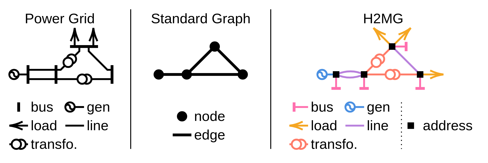
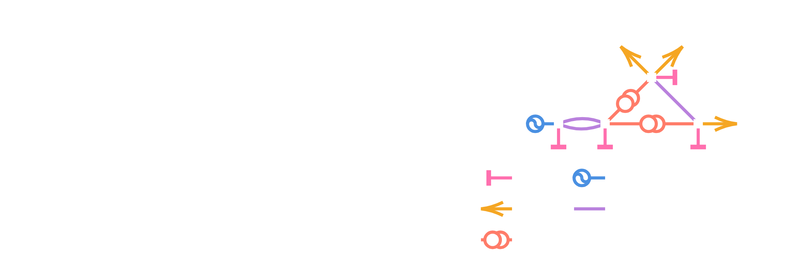

Basics
======

This page introduces the general framework of the **EnerGNN** library.

- It introduces **Amortized Optimization** [1], which encompasses traditional supervised learning.
- It explains how to implement your own use case using the :mod:`energnn.problem` interface.
- It outlines the core features of our :mod:`energnn.graph` data representation module.
- It gives some details about the GNN architectures implemented in :mod:`energnn.model`.
- It shows how to train a GNN model over your own use case using the :mod:`energnn.train` module.

[1] Brandon Amos, *Tutorial on Amortized Optimization*, 2022.

-----

Amortized Optimization
----------------------

Consider an optimization problem formulated as follows:

.. math::

    \begin{align}
        y^\star(x) \in \arg \min _y \ f(y;x),
    \end{align}

where:

- :math:`x` is a **context** graph (input data),
- :math:`y` is a **decision** graph (output data),
- :math:`f` is the **objective** function to minimize.

We seek to solve this problem for a distribution of contexts :math:`x \sim p`,
using a trainable GNN model :math:`\hat{y}_\theta`, parameterized by :math:`\theta`.
This leads to the following **Amortized Optimization** [1] problem:

.. math::

    \begin{align}
        \theta^\star \in \arg \min _\theta \ \mathbb{E}_{x \sim p} [f(\hat{y}_\theta(x);x)].
    \end{align}

**EnerGNN** addresses this learning problem via the following general training loop:

.. math::

    \begin{align}
        x &\sim p & & \text{(1) Context sampling}\\
        \hat{y} &\gets \hat{y}_\theta(x) & & \text{(2) Decision inference} \\
        \hat{g} &\gets \nabla_y f(\hat{y};x) & & \text{(3) Gradient estimation} \\
        \theta &\gets \theta - \alpha J_\theta[\hat{y}_\theta]^\top.\hat{g} & & \text{(4) Back-propagation}
    \end{align}

**EnerGNN** handles steps (2) and (4), which are independent of the use case, while
steps (1) and (3) are use case specific and should respect the provided :mod:`energnn.problem` interface.

-------------------------

Implementing your own Use Case
------------------------------

.. attention:: **Should you use EnerGNN?**

    **EnerGNN** has been designed for Amortized Optimization
    problems where the objective function :math:`f` is
    permutation-invariant (i.e., for any permutation :math:`\sigma`,
    :math:`f(\sigma(y); \sigma(x)) = f(y; x)`).
    This entails that the solution :math:`y^\star` is
    permutation-equivariant (i.e., for any permutation :math:`\sigma`,
    :math:`y^\star(\sigma(x)) = \sigma(y^\star(x))`).
    If this property is not satisfied, then resorting to a GNN is probably not a good idea.

The :mod:`energnn.problem` API provides an interface to integrate your own use cases.
A general overview is provided below, and an in-depth guide is available in :doc:`custom_use_case`.

Problem
.......

The :class:`~energnn.problem.Problem` class defines a single instance of the optimization problem.
It must implement:

- :attr:`~energnn.problem.Problem.context_structure`: General structure of contexts :math:`x`.
- :attr:`~energnn.problem.Problem.decision_structure`: General structure that decisions :math:`y` should respect.
  Notice that gradients :math:`\nabla_y f` share the same structure.
- :meth:`~energnn.problem.Problem.get_context`: Returns the context graph :math:`x`.
- :meth:`~energnn.problem.Problem.get_gradient`: Computes the gradient :math:`\nabla_y f` for a given decision :math:`y`.
  Depending on the use-case, the
  gradient can either be straightforward to compute, or require more expensive Monte-Carlo computations.
- :meth:`~energnn.problem.Problem.get_metrics`: Evaluates the quality of a decision
  (which may or may not coincide with the objective function).

ProblemBatch
............

For training, problems are grouped into a :class:`~energnn.problem.ProblemBatch`.
The interface is the same as for :class:`~energnn.problem.Problem`, but contexts, decisions and
gradients are batched together.

ProblemLoader
.............

The :class:`~energnn.problem.ProblemLoader` is the iterator that provides these batches to the training engine.

.. code-block:: python

    for problem_batch in train_loader:
        context, _ = problem_batch.get_context()
        # Do stuff.
        ...

------------------------

Data Representation using H2MG
------------------------------

Contexts :math:`x`, decisions :math:`y`, and gradients :math:`\nabla_y f`
are all represented as **H2MGs** (*Hyper Heterogeneous Multi Graphs*).

- **Hyper graphs.** Made of hyper-edges that can connect more than 2 entities.
- **Heterogeneous graphs.** Multiple component types (e.g., lines, transformers, etc.).
- **Multi graphs.** Multiple components can be collocated.

In practice, a :class:`~energnn.graph.Graph` is a dictionary of :class:`~energnn.graph.Edge` objects, one per object class.
For computations with JAX, we use :class:`energnn.graph.JaxGraph`,
which is an optimized version compatible with automatic differentiation.

See the :doc:`tutorial_notebook` for an example of H2MG data.

--------------------------

Graph Neural Network Models
---------------------------

**EnerGNN** provides a modular and parametrizable GNN library designed to natively process H2MG data.
The main model, :class:`~energnn.model.SimpleGNN`, follows a modular pipeline:

1. **Normalizer**. Adjusts the distribution of input features (e.g., uniformly distributed between -1 and 1).
2. **Encoder**. Embeds input features into a latent space.
3. **Coupler**. Handles information propagation (e.g., via Message Passing or Neural ODE) over the graph structure.
4. **Decoder**. Produces the final decision from coupled latent representations.

All modules inherit from :class:`flax.nnx.Module`, allowing great flexibility and perfect integration with the JAX ecosystem.

Ready-to-use GNN implementations are available in :mod:`energnn.model.ready_to_use`.

.. code-block:: python

    from energnn.model.ready_to_use import TinyRecurrentEquivariantGNN

    model = TinyRecurrentEquivariantGNN(
        in_structure=problem.context_structure,
        out_structure=problem.decision_structure
    )
    context, _ = problem.get_context()
    decision, _ = model(context)

Notice that the GNN needs to know about the context and decision structures defined by the use-case.

-------------------

Trainer
-------

The :class:`~energnn.trainer.SimpleTrainer` orchestrates the learning process.
It takes as input a model, a gradient transformation (via `optax`), and handles the training loop.

.. code-block:: python

    import optax

    trainer = SimpleTrainer(model=model, gradient_transformation=optax.adam(1e-3))
    trainer.train(train_loader=loader, n_epochs=10)

Additionally, evaluation can be periodically run,
checkpoints can be saved using `orbax`,
and metrics / infos can be monitored using an experiment tracker.

.. code-block:: python

    import orbax.checkpoint as ocp

    checkpoint_manager = ocp.CheckpointManager(directory="tmp")
    my_tracker = ...  # Implement your own

    trainer.train(
        train_loader=train_loader,
        val_loader=val_loader,
        checkpoint_manager=checkpoint_manager,
        tracker=my_tracker,
        n_epochs=10
    )

-----------------------------

Next Steps
----------

Now that you are familiar with the basics, you can:

- Follow the :doc:`tutorial_notebook` for a hands-on example.
- Learn how to implement a :doc:`custom_use_case`.
- Explore the :doc:`reference/index` for detailed API information.
